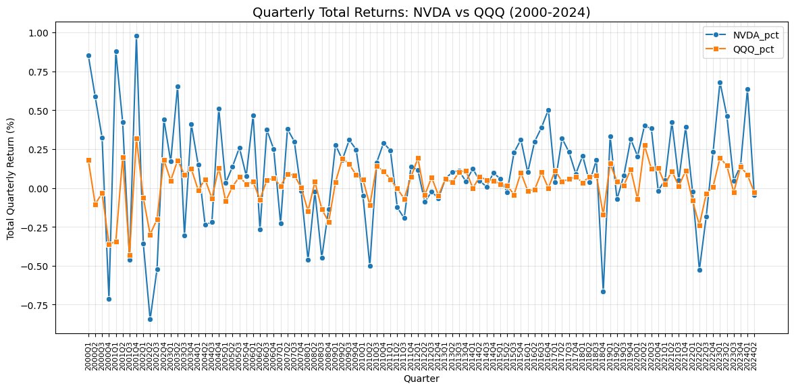
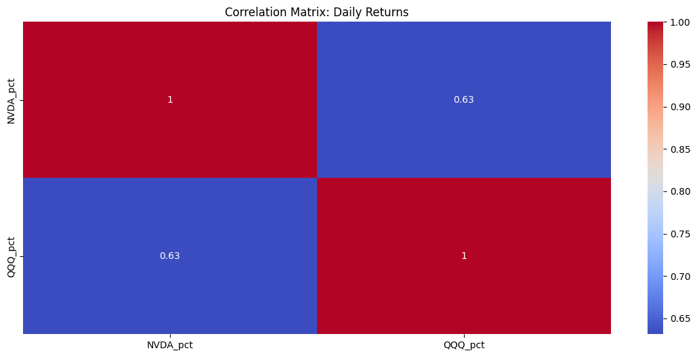
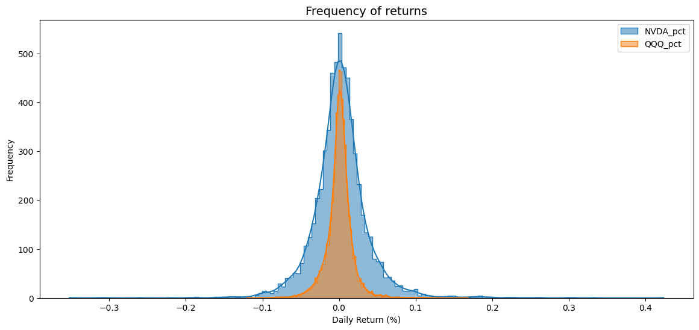
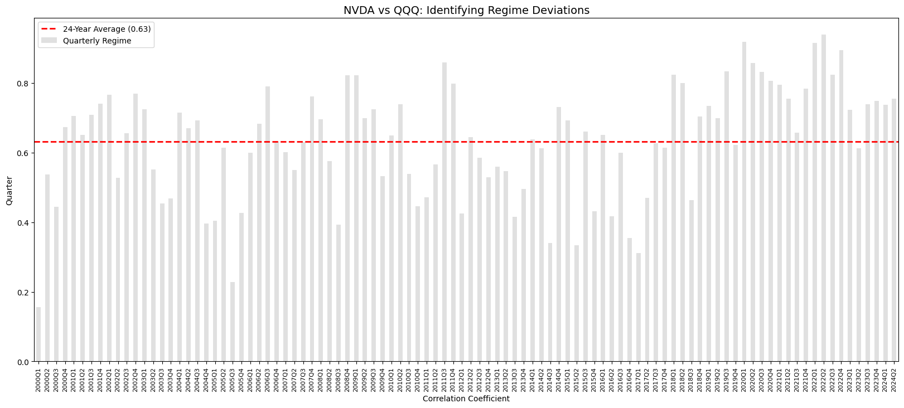
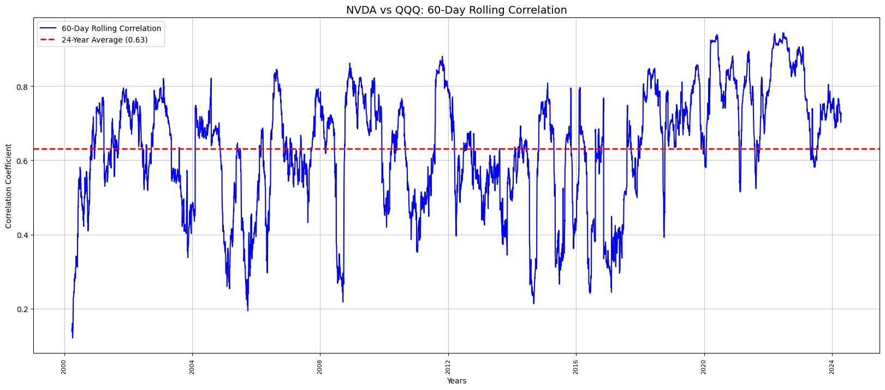

# NVDA vs. QQQ: Volatility & Correlation Analysis (2001-2024)

## Project Overview
This project is an Exploratory Data Analysis (EDA) comparing the historical performance and risk profiles of **NVIDIA (NVDA)** and the **NASDAQ-100 (QQQ)**. By analyzing 23 years of data, this study identifies how NVIDIA transitioned from a speculative tech asset into a primary driver of the broader market index.

## 🚀 How to Run
Follow these steps to set up and run the analysis on your local machine:

### 1. Prerequisites
    Ensure you have **Python 3.8+** installed. You will also need the following libraries, which you can install via terminal:
    ```bash 
    pip install pandas matplotlib seaborn yfinance
    ```
    Ensure you also have jupyter installed.
    install via terminals:
    ```bash
    pip install notebook
    ```

### 2. Execution
    Open your terminal and navigate to the project folder.
    Launch Jupyter Notebook:

    ```bash
        jupyter notebook
    ```
### 3. Open NQ_QQQ_EDA.ipynb and run all cells sequentially.

## Data Methodology & Cleaning
I performed extensive data engineering to ensure an accurate "apples-to-apples" comparison between a single stock and a market index:

### 1. Data Acquisition & Variables
* **NVDA Data**: Fetched daily OHLCV data via the `yfinance` API.
* **QQQ Data**: Sourced split-adjusted daily price data from Kaggle.
* **Primary Metrics**: I focused on **Daily Percentage Returns** rather than raw prices to normalize the data for statistical comparison.

### 2. Technical Challenges Handled
* **Date Alignment**: Since the API data and Kaggle CSV data came from different sources, they contained mismatched trading days. I implemented an **Inner Join** on the 'date' column to ensure the analysis only included mutual trading days.
* **Header Flattening**: Handled multi-level headers from the `yfinance` API to ensure compatibility with standard Pandas operations.
* **Casting & Filtering**: Enforced `dateTime` object casting and filtered the dataset to a consistent start date of January 01, 2001.

## Detailed Visualization Analysis
I utilized six distinct visualizations to provide a 360-degree view of the risk and relationship between these assets:

### 1. Volatility Spread (Box Plot)

* **What it shows**: The distribution of daily returns, emphasizing the Interquartile Range (IQR) and extreme outliers.
* **Insight**: NVDA’s "box" is significantly taller than QQQ’s, proving its standard daily movement is much larger. The presence of extreme outliers on both sides highlights the risk of "black swan" events for individual tech stocks.

### 2. Quarterly Performance Trends (Line Plot)

* **What it shows**: The total percentage return of both assets aggregated by quarter.
* **Insight**: This captures the "Growth" narrative. While QQQ provides steady growth, NVDA exhibits massive vertical spikes during tech booms, significantly outperforming the index during market expansions.

### 3. Correlation Matrix (Heatmap)

* **What it shows**: A numerical Pearson correlation coefficient between the daily returns of both assets.
* **Insight**: This provides a quick "snapshot" confirmation of the linear relationship, showing a high positive correlation that serves as our baseline for deeper analysis.

### 4. Risk Shape / Frequency of Returns (Histogram/KDE)

* **What it shows**: The probability density of returns (The "Bell Curve").
* **Insight**: NVDA exhibits "Fat Tails" (High Kurtosis). This means that while both assets peak near 0%, NVDA has a much higher probability of experiencing ±5% or ±10% days compared to the index.

### 5. Correlation Regime Deviations (Quarterly Bar Chart)

* **What it shows**: Quarterly correlation values compared against the 24-year historical average (0.63).
* **Insight**: This identifies "Regime Shifts." It clearly shows quarters where NVDA decoupled from the market (low bars) versus quarters where it moved in lock-step with the NASDAQ (high bars).

### 6. 60-Day Rolling Correlation (Line Chart)

* **What it shows**: The evolution of the relationship over time using a moving 60-day window.
* **Insight**: This highlights the **"AI Surge" effect (2020-2024)**. The correlation has recently spiked and stayed above 0.8, proving that NVDA is no longer just a component of the index—it is now a primary driver of the index's direction.

## Tech Stack
* **Language**: Python
* **Libraries**: `Pandas` (Data Cleaning), `Matplotlib` & `Seaborn` (Visualization), `yfinance` (API Data Fetching).

## Strategic Conclusion
For investors, this data proves that **NVDA acts as a high-beta version of the tech market**. While it offers superior growth potential, it requires wider risk parameters (Stop Losses) to survive daily "noise." The tightening correlation in recent years suggests that holding both NVDA and QQQ offers decreasing diversification benefits, as they increasingly move as a single unit.

---
*Created for my Data Science Portfolio by Nhlanhla Zizwe Matthews.*